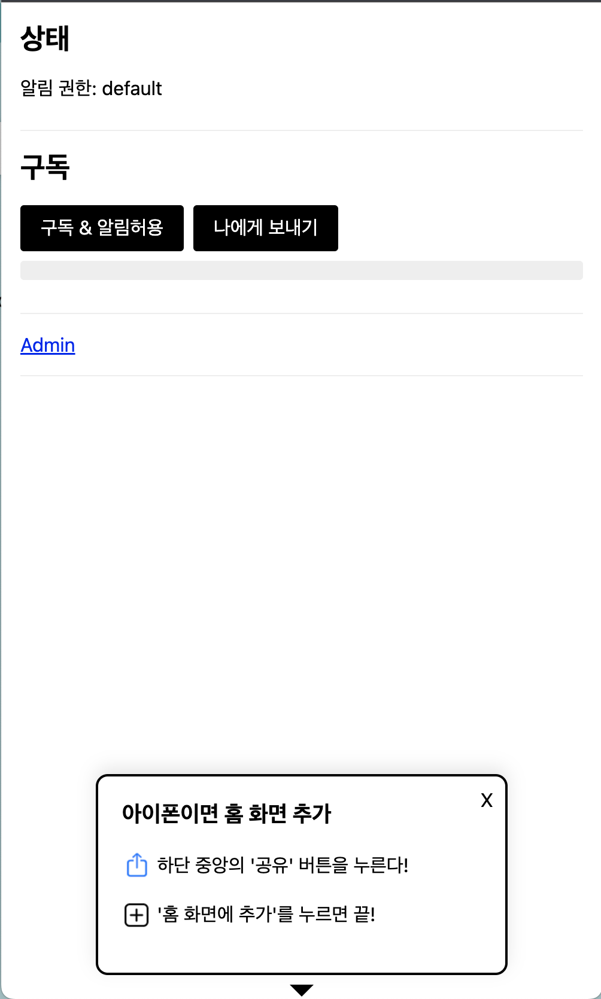

웹 푸시 기술과 PWA(Progressive Web Apps)의 조합은 모바일 사용자 경험을 혁신적으로 개선하는 방법 중 하나입니다. 특히 iOS 16.4 업데이트 이후 iOS에서 웹 푸시를 지원하기 시작하면서 이 기술이 더욱 주목받고 있습니다. 여기에는 PWA의 중요한 역할과 FCM(Firebase Cloud Messaging)을 활용한 구현 방법에 대한 자세한 설명이 포함되어 있습니다.

## IOS에서의 웹 푸시와 웹 앱의 통합

iOS에서 웹 푸시를 받기 위한 과정은 다소 복잡합니다. 사용자는 Safari 브라우저를 통해 웹사이트에 접속한 후, 해당 사이트를 홈 화면에 추가하고, 이를 통해 웹 앱을 실행해야 합니다. 이 과정을 통해서만 푸시 알림을 허용할 수 있습니다. 중요한 점은, 이 기능이 PWA를 지원하는 웹사이트에서만 가능하다는 것입니다.

## FCM을 활용한 웹 푸시 구현

1. FCM SDK 추가 및 초기화
   Firebase 설정을 통해 FCM SDK를 초기화하는 과정입니다. 이를 통해 앱의 기본 구성을 설정하고 메시징 서비스를 시작할 수 있습니다.

```typescript
const firebaseConfig = {
  apiKey: '',
  authDomain: '',
  projectId: '',
  storageBucket: '',
  messagingSenderId: '',
  appId: '',
};

const app = initializeApp(firebaseConfig);
const messaging = getMessaging(app);
```

2. 푸시 권한 요청
   Notification.requestPermission() 함수를 사용하여 사용자에게 푸시 알림을 보낼 수 있는 권한을 요청합니다. 이 함수는 사용자의 상호작용(예: 클릭)을 통해 호출되도록 하는 것이 좋습니다.

`Notification.requestPermission()` 를 통해 푸시 권한을 요청할 수 있습니다.

```typescript
Notification.requestPermission().then((permission) => {
  if (permission !== 'granted') {
    // 푸시 거부됐을 때 처리할 내용
  } else {
    // 푸시 승인됐을 때 처리할 내용
  }
});
```

> 참고로 Notification.requestPermission() 을 통한 권한 요청은 사용자의 클릭을 통해서 호출되도록 하는 것을 권장한다.

3. 토큰 발급
   FCM은 푸시 알림을 보내기 위해 특정 토큰을 사용합니다. 사용자가 푸시 권한을 부여하면, 이 토큰을 발급받아 서버에 저장합니다.


vapid key가 준비되었다면 아래와 같이 토큰을 발급 받을 수 있습니다.

```typescript
const messaging = getMessaging()

getToken(messaging, {
  vapidKey: [vapid key],
})
  .then(async currentToken => {
    if (!currentToken) {
      // 토큰 생성 불가시 처리할 내용, 주로 브라우저 푸시 허용이 안된 경우에 해당한다.
    } else {
      // 토큰을 받았다면 호다닥 서버에 저장
    }
  })
  .catch(error => {
    // 예외처리
  })
```

## 서비스워커(Service Worker)의 역할

서비스워커는 웹 애플리케이션의 백그라운드에서 실행되며, 푸시 알림을 받고 처리합니다. FCM을 이용하기 위해서는 특정 파일명(`firebase-messaging-sw.js`)으로 서비스워커 파일을 생성해야 합니다.

> FCM을 이용해 웹푸시를 전송하기 위해서는 서비스워커 파일명을 반드시 firebase-messaging-sw.js로 해야 합니다.

```javascript
importScripts('https://www.gstatic.com/firebasejs/10.5.0/firebase-app-compat.js');
importScripts('https://www.gstatic.com/firebasejs/10.5.0/firebase-messaging-compat.js');

const config = {
  apiKey: '',
  authDomain: '',
  projectId: '',
  storageBucket: '',
  messagingSenderId: '',
  appId: '',
};

//Initialize Firebase
firebase.initializeApp(config);
const messaging = firebase.messaging();

// 푸시 전송
self.addEventListener('push', async (event) => {
  if (event.data) {
    log('push data', event.data.json());

    // const { data } = event.data.json();
    const data = event.data.json().data;
    log('icon', data.icon);

    const options = {
      body: data.body,
      icon: data.icon ?? '/icons/icon-256.png',
      image: data.image,
      data: {
        click_action: data.click_action, // 이 필드는 밑의 클릭 이벤트 처리에 사용됨
      },
    };
    event.waitUntil(self.registration.showNotification(data.title, options));
  }
});

//푸시 클릭시 이동 사이트
self.addEventListener('notificationclick', (event) => {
  log('push', { event });
  event.notification.close();
  try {
    const openLink = event.notification.data.click_action;
    self.clients.openWindow(openLink);
  } catch {
    self.clients.openWindow('https://blog.devtimes.com');
  }
});
```

## 푸시 알림 발송

Firebase Admin SDK를 사용하여 서버측 API를 구현하고, 이를 통해 FCM을 통해 푸시 알림을 발송합니다. 이 과정에서 서비스 계정 키를 사용하며, API를 통해 푸시 메시지를 구성하고 전송합니다.

- firebase-admin 설치

  ```
  npm i firebase-admin --save
  ```

- 서비스 계정 키 준비
  파이어베이스의 프로젝트 설정 -> 서비스 계정에서 새 비공개 키 생성 버튼을 클릭해 json 파일을 다운로드 하고 이파일을 환경 변수에 잘 저장해둡니다. 아래와 같이 생긴 파일 입니다.

  ```javascript
  {
    "type": "...",
    "project_id": "...",
    "private_key_id": "...",
    "private_key": "...",
    "client_email": "...",
    "client_id": "...",
    "auth_uri": "https://accounts.google.com/o/oauth2/auth",
    "token_uri": "https://oauth2.googleapis.com/token",
    "auth_provider_x509_cert_url": "https://www.googleapis.com/oauth2/v1/certs",
    "client_x509_cert_url": "...",
    "universe_domain": "googleapis.com"
  }

  ```

### API 파일 생성

lib/firebase-admin-sdk.ts

```typescript
var firebaseAdmin = require('firebase-admin');
var serviceAccount = require('public/data/firebase-adminsdk.json');

if (firebaseAdmin.apps.length == 0) {
  firebaseAdmin.initializeApp({
    credential: firebaseAdmin.credential.cert(serviceAccount),
  });
}

export default firebaseAdmin;
```

api/push/route.ts

```typescript
import { NextRequest, NextResponse } from 'next/server';

import firebaseAdmin from '@/lib/firebase-admin-sdk';

export async function POST(request: NextRequest) {
  const reqBody = await request.json();
  const { deviceToken, title, body, icon, image, click_action } = reqBody;

  const message = {
    token: deviceToken,
    data: {
      title,
      body,
      icon,
      image,
      click_action,
    },
  };

  console.log('🚀🚀🚀 FCM Send Message 🚀🚀🚀\n', message);

  //단일
  try {
    await firebaseAdmin.messaging().send(message);
    return NextResponse.json({ success: true, message: '전송완료' });
  } catch (error: any) {
    console.log('[ERROR] : ', error.errorInfo);
    return NextResponse.json({ success: false, message: '전송실패' });
  }
}
```

프로젝트를 실행하면 아래와 같은 테스트 화면을 볼수 있습니다. 아이폰의 경우 먼저 앱설치가 진행이 되어야 하기 대문에 그림과 같은 안내가 필요할 것 같습니다.

<!--  -->


## 마치며

PWA와 웹 푸시는 함께 가야 할 기술입니다. iOS에서는 PWA 상태에서만 웹 푸시를 수신할 수 있으며, 이는 사용자 경험을 향상시키는 동시에 무분별한 알림 사용을 방지합니다. 또한, 웹 푸시 알림을 해제하는 방법에 대한 정보가 부족한 것은 문제점으로 지적될 수 있습니다. 이 글은 웹 푸시 기술과 PWA의 적절한 사용 및 구현 방법에 대한 유용한 가이드를 제공합니다.

샘플 코드와 프로젝트는 GitHub에서 확인할 수 있으며, FCM의 사용 여부에 따라 다른 두 가지 버전이 제공됩니다.

샘플은 아래 github에 올려두었으니, 참고하세요.

- FCM 사용 : https://github.com/winuss/pwa-app-fcm
- FCM X : https://github.com/winuss/pwa-app
